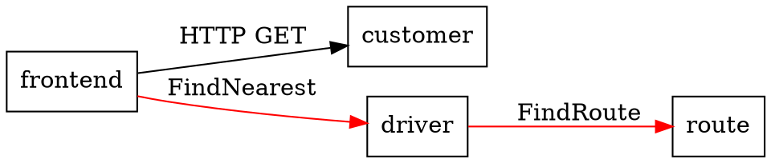

# jmcp - Jaeger MCP CLI

## Product Requirements Document

### What This Is

A production-grade CLI debugging tool for Jaeger MCP. Goes beyond wrapping MCP calls — it helps engineers **investigate incidents, document findings, generate shareable reports, and build reproducible debugging workflows**.

This is NOT an AI agent. NOT an LLM integration tool. It is a production debugging and incident investigation tool for teams using Jaeger.

### Why This Exists

Jaeger (https://github.com/jaegertracing/jaeger) recently added an MCP extension that exposes distributed tracing data through the Model Context Protocol. The MCP server runs over HTTP with JSON-RPC 2.0 over Server-Sent Events (SSE).

Today, interacting with it manually requires:
1. A multi-step session initialization handshake
2. Extracting session IDs from HTTP response headers
3. Sending a separate `notifications/initialized` message
4. Constructing verbose JSON-RPC payloads for every tool call
5. Parsing raw SSE stream output to find the actual result
6. Repeating all of this every 5 minutes when the session expires

This CLI automates all of that and provides a clean command-line interface to every MCP tool Jaeger exposes.

### Reference Implementation

The Jaeger MCP server source code lives at:
```
github.com/jaegertracing/jaeger
  cmd/jaeger/internal/extension/jaegermcp/
```

Key source files (for understanding protocol and types):
- `server.go` - MCP server setup, tool registration, middleware
- `config.go` - Server configuration (timeouts, limits)
- `internal/handlers/` - All tool handler implementations
- `internal/types/types.go` - All input/output type definitions
- `README.md` - Usage documentation with curl examples

---

## MCP Protocol Details (Critical for Implementation)

### Transport Layer

Jaeger MCP uses **Streamable HTTP** transport:
- Single endpoint: `POST /mcp`
- Default port: `16687`
- Full URL: `http://localhost:16687/mcp`
- Protocol: JSON-RPC 2.0 over Server-Sent Events (SSE) over HTTP
- Content-Type for requests: `application/json`
- Response format: SSE stream (`text/event-stream`)

### Session Lifecycle

#### Step 1: Initialize

```http
POST /mcp HTTP/1.1
Content-Type: application/json

{
  "jsonrpc": "2.0",
  "id": 1,
  "method": "initialize",
  "params": {
    "protocolVersion": "2024-11-05",
    "capabilities": {},
    "clientInfo": {
      "name": "jmcp",
      "version": "0.1.0"
    }
  }
}
```

Response contains:
- **Header**: `Mcp-Session-Id: <SESSION_ID>` (e.g., `SAWYSMIJP3CA6P6PONC4QB3QLT`)
- **Body** (SSE): Server info, capabilities, instructions

The session ID from the response header MUST be captured and included in all subsequent requests.

#### Step 2: Send Initialized Notification

This is a JSON-RPC **notification** (no `id` field, no response expected):

```http
POST /mcp HTTP/1.1
Content-Type: application/json
Mcp-Session-Id: <SESSION_ID>

{
  "jsonrpc": "2.0",
  "method": "notifications/initialized"
}
```

#### Step 3: Tool Calls

All tool calls use the same endpoint with the session header:

```http
POST /mcp HTTP/1.1
Content-Type: application/json
Mcp-Session-Id: <SESSION_ID>

{
  "jsonrpc": "2.0",
  "id": 2,
  "method": "tools/call",
  "params": {
    "name": "<tool_name>",
    "arguments": { ... }
  }
}
```

### SSE Response Parsing

Responses come as Server-Sent Events. Format:
```
event: message
data: {"jsonrpc":"2.0","id":2,"result":{"content":[{"type":"text","text":"{...JSON...}"}]}}

```

Key parsing rules:
- Lines starting with `event:` specify event type
- Lines starting with `data:` contain the JSON-RPC response
- Blank line terminates an event
- The actual tool result is inside `result.content[0].text` as a JSON string (double-encoded)
- Must handle `result.content[0].text` being a JSON string that needs a second parse
- Must handle `error` field in JSON-RPC response for error cases

### Session Management

- Sessions timeout after **5 minutes** of inactivity
- On timeout/invalid session, server returns an error
- CLI must detect this and automatically re-initialize
- JSON-RPC request `id` should increment per request within a session

---

## Jaeger MCP Tools (Complete Reference)

### Tool: `health`

**Purpose**: Server health check.

**Input**: None (empty arguments `{}`)

**Output**:
```json
{
  "status": "ok",
  "server": "jaeger",
  "version": "dev"
}
```

---

### Tool: `get_services`

**Purpose**: List all traced services.

**Input**:
| Field | Type | Required | Default | Description |
|-------|------|----------|---------|-------------|
| `pattern` | string | No | - | Regex filter for service names |
| `limit` | int | No | - | Max results |

**Output**:
```json
{
  "services": ["frontend", "customer", "driver", "route"]
}
```

---

### Tool: `get_span_names`

**Purpose**: List operation/span names for a service.

**Input**:
| Field | Type | Required | Default | Description |
|-------|------|----------|---------|-------------|
| `service_name` | string | Yes | - | Service to query |
| `pattern` | string | No | - | Regex filter |
| `span_kind` | string | No | - | Filter by kind (client/server/internal/producer/consumer) |
| `limit` | int | No | - | Max results |

**Output**:
```json
{
  "span_names": [
    {"name": "HTTP GET /api/traces", "span_kind": "server"},
    {"name": "SQL SELECT", "span_kind": "client"}
  ]
}
```

---

### Tool: `search_traces`

**Purpose**: Search traces by criteria. Returns lightweight summaries only (not full trace data).

**Input**:
| Field | Type | Required | Default | Description |
|-------|------|----------|---------|-------------|
| `service_name` | string | Yes | - | Service to search |
| `span_name` | string | No | - | Filter by operation name |
| `start_time_min` | string | No | "-1h" | RFC3339 or relative duration (e.g., "-1h", "-30m") |
| `start_time_max` | string | No | "now" | RFC3339 or relative duration |
| `attributes` | map[string]string | No | - | Key-value attribute filters |
| `with_errors` | bool | No | false | Only return traces with errors |
| `duration_min` | string | No | - | Min duration (e.g., "100ms", "2s") |
| `duration_max` | string | No | - | Max duration (e.g., "10s", "1m") |
| `search_depth` | int | No | 10 | Max traces to return (server max: 100) |

**Output**:
```json
{
  "trace_count": 3,
  "traces": [
    {
      "trace_id": "abc123def456...",
      "root_service": "frontend",
      "root_span_name": "HTTP GET /dispatch",
      "start_time": "2025-01-15T10:30:00Z",
      "duration_us": 45200,
      "span_count": 12,
      "service_count": 4,
      "services": ["customer", "driver", "frontend", "route"],
      "has_errors": true
    }
  ]
}
```

---

### Tool: `get_trace_topology`

**Purpose**: Get trace structure as a flat depth-first list. Uses path encoding for parent-child relationships instead of nested objects.

**Input**:
| Field | Type | Required | Default | Description |
|-------|------|----------|---------|-------------|
| `trace_id` | string | Yes | - | Trace ID to inspect |
| `depth` | int | No | - | Max tree depth (truncates deeper spans) |

**Output**:
```json
{
  "trace_id": "abc123...",
  "spans": [
    {
      "path": "rootSpanId",
      "service": "frontend",
      "span_name": "HTTP GET /dispatch",
      "start_time": "2025-01-15T10:30:00Z",
      "duration_us": 45200,
      "status": "Ok",
      "truncated_children": 0
    },
    {
      "path": "rootSpanId/childSpanId",
      "service": "customer",
      "span_name": "SQL SELECT",
      "start_time": "2025-01-15T10:30:01Z",
      "duration_us": 1200,
      "status": "Error",
      "truncated_children": 3
    }
  ]
}
```

Path encoding: `"rootID/parentID/spanID"` — each segment is a span ID, depth = number of segments.

---

### Tool: `get_trace_errors`

**Purpose**: Get all error spans in a trace with full details.

**Input**:
| Field | Type | Required | Default | Description |
|-------|------|----------|---------|-------------|
| `trace_id` | string | Yes | - | Trace ID to inspect |

**Output**:
```json
{
  "trace_id": "abc123...",
  "total_error_count": 5,
  "spans": [
    {
      "span_id": "span123",
      "trace_id": "abc123...",
      "parent_span_id": "parentSpan456",
      "service": "customer",
      "span_name": "SQL SELECT",
      "start_time": "2025-01-15T10:30:01Z",
      "duration_us": 1200,
      "status": {"code": "Error", "message": "connection refused"},
      "attributes": {"db.system": "mysql", "db.statement": "SELECT ..."},
      "events": [
        {
          "name": "exception",
          "timestamp": "2025-01-15T10:30:01.5Z",
          "attributes": {"exception.type": "ConnectionError", "exception.message": "..."}
        }
      ],
      "links": []
    }
  ]
}
```

Note: `total_error_count` may be larger than `spans.length` due to server-side truncation (max 20 spans per request by default).

---

### Tool: `get_span_details`

**Purpose**: Fetch full OTLP details for specific spans. Use this after identifying interesting spans via topology or search.

**Input**:
| Field | Type | Required | Default | Description |
|-------|------|----------|---------|-------------|
| `trace_id` | string | Yes | - | Trace ID |
| `span_ids` | []string | Yes | - | List of span IDs to fetch (max 20 per request) |

**Output**:
```json
{
  "trace_id": "abc123...",
  "spans": [
    {
      "span_id": "span123",
      "trace_id": "abc123...",
      "parent_span_id": "parentSpan456",
      "service": "customer",
      "span_name": "SQL SELECT",
      "start_time": "2025-01-15T10:30:01Z",
      "duration_us": 1200,
      "status": {"code": "Ok"},
      "attributes": {"db.system": "mysql", "net.peer.name": "db-host"},
      "events": [],
      "links": []
    }
  ]
}
```

---

### Tool: `get_critical_path`

**Purpose**: Identify the latency-critical span chain through a trace. Shows which spans are on the critical path and their self-time.

**Input**:
| Field | Type | Required | Default | Description |
|-------|------|----------|---------|-------------|
| `trace_id` | string | Yes | - | Trace ID to analyze |

**Output**:
```json
{
  "trace_id": "abc123...",
  "total_duration_us": 45200,
  "critical_path_duration_us": 38000,
  "segments": [
    {
      "span_id": "span123",
      "service": "frontend",
      "span_name": "HTTP GET /dispatch",
      "self_time_us": 5000,
      "start_offset_us": 0,
      "end_offset_us": 5000
    },
    {
      "span_id": "span456",
      "service": "driver",
      "span_name": "FindNearest",
      "self_time_us": 33000,
      "start_offset_us": 5000,
      "end_offset_us": 38000
    }
  ]
}
```

---

### Tool: `get_service_dependencies`

**Purpose**: Get service dependency graph for a time window.

**Input**:
| Field | Type | Required | Default | Description |
|-------|------|----------|---------|-------------|
| `start_time` | string | No | - | RFC3339 or relative duration |
| `end_time` | string | No | - | RFC3339 or relative duration |

**Output**:
```json
{
  "dependencies": [
    {"caller": "frontend", "callee": "customer", "call_count": 142},
    {"caller": "frontend", "callee": "driver", "call_count": 89},
    {"caller": "frontend", "callee": "route", "call_count": 89}
  ]
}
```

---

## CLI Architecture

### Language: Go

Reasons:
- Jaeger ecosystem is Go. This tool may eventually upstream.
- Single binary distribution via `go install`
- No runtime dependencies
- Strong HTTP/SSE library ecosystem

### Dependencies

| Package | Purpose |
|---------|---------|
| `github.com/spf13/cobra` | CLI framework |
| `github.com/jedib0t/go-pretty/v6` | Table output formatting |
| `github.com/fatih/color` | Terminal colors |
| `github.com/charmbracelet/huh` | Interactive prompts (service picker, trace picker) |
| Standard library `net/http`, `bufio` | HTTP client, SSE parsing |

Note on SSE: Go standard library `bufio.Scanner` is sufficient for SSE parsing since Jaeger MCP responses are not complex streaming — typically a single SSE event per tool call. No need for a heavy SSE library. Parse lines: skip `event:` lines, extract `data:` lines, detect blank line as event terminator.

Note on `charmbracelet/huh`: Used for interactive picker only. All commands still work non-interactively with explicit trace IDs or `@N` refs. If stdin is not a TTY (piped/scripted), skip interactive mode and error with "trace ID required".

### Project Structure

```
jmcp/
├── main.go                     # Entry point, Cobra root command setup
├── go.mod
├── go.sum
├── Makefile                    # build, test, lint, install targets
├── README.md                   # Usage documentation
├── PRD.md                      # This file
├── internal/
│   ├── client/
│   │   ├── client.go           # MCP client: session init, tool calls, reconnect
│   │   ├── client_test.go      # Unit tests with mock HTTP server
│   │   ├── sse.go              # SSE response parser
│   │   └── sse_test.go
│   ├── cmd/
│   │   ├── root.go             # Root command, global flags
│   │   ├── health.go           # jmcp health
│   │   ├── services.go         # jmcp services
│   │   ├── spans.go            # jmcp spans <service>
│   │   ├── search.go           # jmcp search <service> [flags]
│   │   ├── topology.go         # jmcp topology <trace-id>
│   │   ├── errors.go           # jmcp errors <trace-id>
│   │   ├── details.go          # jmcp details <trace-id> <span-id>...
│   │   ├── critical_path.go    # jmcp critical-path <trace-id>
│   │   ├── deps.go             # jmcp deps
│   │   ├── investigate.go      # jmcp investigate <trace-id> (compound)
│   │   ├── report.go           # jmcp report <trace-id> (generate report)
│   │   ├── snapshot.go         # jmcp snapshot <service>
│   │   ├── diff.go             # jmcp diff <snap-a> <snap-b>
│   │   ├── watch.go            # jmcp watch <service> (live poll)
│   │   ├── blame.go            # jmcp blame <trace-id> (root cause)
│   │   ├── export.go           # jmcp export <trace-id> (json/csv/dot)
│   │   ├── check.go            # jmcp check <service> (CI health gate)
│   │   ├── replay.go           # jmcp replay <report-file>
│   │   └── init_project.go     # jmcp init (.jmcp/ directory)
│   ├── output/
│   │   ├── formatter.go        # Output formatting: table, json, raw
│   │   ├── formatter_test.go
│   │   ├── table.go            # Table rendering helpers
│   │   ├── tree.go             # Tree rendering (topology)
│   │   ├── report.go           # Markdown report generator
│   │   └── color.go            # Color/status helpers
│   ├── trace/
│   │   ├── resolver.go         # Trace ID resolution: explicit, @N, interactive
│   │   ├── resolver_test.go
│   │   ├── picker.go           # Interactive trace picker (service select → search → pick)
│   │   ├── cache.go            # Last search result cache (.jmcp/.last_search.json)
│   │   └── cache_test.go
│   ├── analysis/
│   │   ├── blame.go            # Root cause heuristics (no AI)
│   │   ├── blame_test.go
│   │   ├── stats.go            # P50/P95/P99 calculations
│   │   ├── stats_test.go
│   │   ├── diff.go             # Snapshot comparison logic
│   │   └── diff_test.go
│   └── store/
│       ├── snapshot.go         # Read/write snapshots to disk
│       ├── report.go           # Read/write reports to disk
│       └── config.go           # .jmcp/config.yaml handling
└── .goreleaser.yml             # Cross-platform release builds
```

### MCP Client Implementation (`internal/client/client.go`)

```go
// Core interface the client must implement
type Client struct {
    endpoint   string        // e.g., "http://localhost:16687/mcp"
    sessionID  string        // Captured from Mcp-Session-Id header
    requestID  int           // Auto-incrementing JSON-RPC request ID
    httpClient *http.Client
    mu         sync.Mutex    // Protects sessionID and requestID
}

// Required methods:
func New(endpoint string, opts ...Option) *Client
func (c *Client) Initialize(ctx context.Context) error          // Steps 1+2
func (c *Client) CallTool(ctx context.Context, tool string, args any) (json.RawMessage, error)
func (c *Client) ensureSession(ctx context.Context) error       // Auto-reconnect on timeout
```

Auto-reconnect logic:
1. On any tool call, if response indicates invalid/expired session
2. Automatically call `Initialize()` again
3. Retry the original tool call once
4. Fail if retry also fails

### SSE Parser Implementation (`internal/client/sse.go`)

```go
// Parse SSE response body into JSON-RPC result
func ParseSSEResponse(body io.Reader) (*JSONRPCResponse, error)

// JSONRPCResponse represents the parsed response
type JSONRPCResponse struct {
    ID     int              `json:"id"`
    Result *json.RawMessage `json:"result,omitempty"`
    Error  *JSONRPCError    `json:"error,omitempty"`
}

type JSONRPCError struct {
    Code    int    `json:"code"`
    Message string `json:"message"`
}
```

Parsing approach:
1. Read response body line by line with `bufio.Scanner`
2. Skip lines starting with `event:`
3. For lines starting with `data:`, strip prefix and accumulate
4. On blank line, parse accumulated data as JSON-RPC response
5. Extract `result.content[0].text` and parse that as the actual tool output

---

## Trace Selection System (Core UX Principle)

**Design goal**: User should NEVER have to copy-paste a trace ID. Every command that takes a trace ID should also work without one.

### How Trace Selection Works

There are 3 ways to provide a trace to any trace-consuming command:

#### 1. Explicit trace ID (power users, scripts)
```bash
jmcp topology abc123def456
```

#### 2. Interactive picker (default when no trace ID given)
```bash
jmcp topology
# No trace ID → triggers interactive search picker:
#
# Service? (tab-complete from discovered services): frontend
# Filter errors only? [y/N]: y
# Time range [1h]: 30m
#
# Found 5 traces:
#
#   #  TIME                  ROOT SPAN              DURATION  SPANS  ERRORS
#   1  10:30:05 (2min ago)   HTTP GET /dispatch     45.2ms    12     yes
#   2  10:28:12 (4min ago)   HTTP GET /customer     890ms     8      yes
#   3  10:25:33 (7min ago)   HTTP GET /dispatch     12.1ms    5      yes
#   4  10:22:01 (10min ago)  HTTP POST /order       234ms     15     yes
#   5  10:18:45 (13min ago)  HTTP GET /dispatch     38ms      11     yes
#
# Select [1-5]: 2
#
# → runs topology on trace from row 2
```

Every trace-consuming command (`topology`, `errors`, `details`, `critical-path`, `investigate`, `report`, `blame`, `export`) uses this same picker when called without a trace ID.

The picker shows **relative time** ("2min ago", "1h ago") so user can identify which trace is theirs without knowing trace IDs.

#### 3. Last-used trace shortcut
```bash
jmcp search frontend --errors       # Shows results, caches to .jmcp/.last_search.json
jmcp topology @1                    # Use trace #1 from last search
jmcp errors @1                      # Same trace, different view
jmcp blame @last                    # Shorthand for @1 (most recent)
```

The `@N` syntax references the Nth result from the last search. `@last` = `@1`.

Cached in `.jmcp/.last_search.json` (or `/tmp/jmcp_last_search.json` if no `.jmcp/` dir).

### Implementation: Trace Resolver

All trace-consuming commands call a shared `resolveTraceID()` function:

```go
// internal/trace/resolver.go

func ResolveTraceID(args []string, client *client.Client) (string, error) {
    // 1. Explicit trace ID provided as argument
    if len(args) > 0 && !strings.HasPrefix(args[0], "@") {
        return args[0], nil
    }

    // 2. @N or @last reference from cached search
    if len(args) > 0 && strings.HasPrefix(args[0], "@") {
        return resolveFromCache(args[0])
    }

    // 3. No argument → interactive picker
    return interactivePicker(client)
}
```

Interactive picker uses `github.com/AlecAivazis/survey/v2` or `github.com/charmbracelet/huh` for clean terminal prompts. Service name input supports tab-completion from `get_services` results.

---

## Full Command Reference

### Global Flags

| Flag | Short | Default | Description |
|------|-------|---------|-------------|
| `--endpoint` | `-e` | `http://localhost:16687/mcp` | MCP server endpoint |
| `--output` | `-o` | `table` | Output format: `table`, `json`, `raw` |
| `--save` | `-s` | - | Save output to file |
| `--timeout` | `-t` | `30s` | Request timeout |
| `--no-color` | - | false | Disable colored output |
| `--verbose` | `-v` | false | Show request/response details for debugging |

### `jmcp health`

Check server health.

```bash
$ jmcp health
Status:  ok
Server:  jaeger
Version: v2.4.0
```

### `jmcp services`

List traced services.

```bash
$ jmcp services
$ jmcp services --pattern "front.*"
$ jmcp services --limit 10
```

Table output:
```
SERVICE
────────────
customer
driver
frontend
route
```

### `jmcp spans <service>`

List span names for a service. If `<service>` is omitted, shows interactive service picker.

```bash
$ jmcp spans frontend
$ jmcp spans frontend --kind server
$ jmcp spans frontend --pattern "HTTP.*"
$ jmcp spans                          # → interactive: pick service first
```

Table output:
```
SPAN NAME               KIND
─────────────────────── ──────
HTTP GET /dispatch      server
HTTP GET /customer      client
SQL SELECT              client
```

### `jmcp search <service>`

Search traces for a service. If `<service>` is omitted, shows interactive service picker.
Results are cached for `@N` references.

```bash
$ jmcp search frontend
$ jmcp search frontend --errors
$ jmcp search frontend --errors --since 30m --depth 20
$ jmcp search frontend --min-duration 1s --max-duration 10s
$ jmcp search frontend --attr http.method=GET --attr http.status_code=500
$ jmcp search frontend --span "HTTP GET /dispatch"
$ jmcp search                         # → interactive: pick service first
```

| Flag | Default | Description |
|------|---------|-------------|
| `--span` | - | Filter by span/operation name |
| `--since` | `1h` | Look back duration |
| `--until` | `now` | End time (RFC3339 or relative) |
| `--errors` | false | Only traces with errors |
| `--depth` | 10 | Max number of traces |
| `--min-duration` | - | Minimum trace duration |
| `--max-duration` | - | Maximum trace duration |
| `--attr` | - | Attribute filter (repeatable) KEY=VALUE |

Table output:
```
 #  TRACE ID          ROOT SPAN              DURATION  SPANS  SERVICES  ERRORS  TIME
 1  abc123def456...   HTTP GET /dispatch     45.2ms    12     4         yes     2min ago
 2  def789abc012...   HTTP GET /customer     12.1ms    5      2         no      5min ago
```

Note: `#` column = reference number for `@N` syntax. `TIME` column = relative time.

Duration formatting: display microseconds as human-readable (e.g., `45.2ms`, `1.2s`, `3m12s`).

After search completes, results are cached. Use `@1`, `@2`, etc. in subsequent commands.

### `jmcp topology [trace-id | @N]`

Show trace topology as indented tree.

```bash
$ jmcp topology abc123def456       # explicit trace ID
$ jmcp topology @1                 # first result from last search
$ jmcp topology @last              # same as @1
$ jmcp topology                    # no arg → interactive picker
$ jmcp topology --depth 3          # with depth limit (picker or @last)
```

| Flag | Default | Description |
|------|---------|-------------|
| `--depth` | - | Max tree depth |

Tree output (derived from path encoding):
```
abc123def456
├── [frontend] HTTP GET /dispatch (45.2ms) OK
│   ├── [customer] HTTP GET (12.1ms) OK
│   │   └── [mysql] SQL SELECT (1.2ms) OK
│   ├── [driver] FindNearest (33.0ms) ERROR
│   │   └── [route] FindRoute (28.5ms) OK [+3 truncated]
│   └── [frontend] format-response (0.8ms) OK
```

The tree MUST be reconstructed from the flat path-encoded spans:
- Split each span's `path` field by `/`
- Number of segments = depth level
- Build tree structure in memory, then render with box-drawing characters
- Show `[+N truncated]` when `truncated_children > 0`
- Color `ERROR` status red, `OK` green

### `jmcp errors [trace-id | @N]`

Show error spans in a trace.

```bash
$ jmcp errors abc123def456
$ jmcp errors @1
$ jmcp errors                      # → interactive picker
```

Table output:
```
Total errors: 5 (showing 3)

SPAN ID   SERVICE   SPAN NAME      DURATION  ERROR
───────── ──────── ────────────── ───────── ──────────────────
span123   customer  SQL SELECT     1.2ms     connection refused
span456   driver    FindNearest    33.0ms    timeout exceeded
span789   route     HTTP GET       28.5ms    503 Service Unavailable
```

Show truncation warning when `total_error_count > len(spans)`.

### `jmcp details [trace-id] <span-id>...`

Get full details for specific spans. Trace ID can be `@N` or omitted (picker). Span IDs are required.

```bash
$ jmcp details abc123 span123
$ jmcp details abc123 span123 span456 span789
$ jmcp details @1 span123          # trace from last search
```

Detailed output per span:
```
Span: span123
  Service:    customer
  Name:       SQL SELECT
  Parent:     parentSpan456
  Start:      2025-01-15T10:30:01Z
  Duration:   1.2ms
  Status:     Error - connection refused

  Attributes:
    db.system       = mysql
    db.statement    = SELECT * FROM customers WHERE id = ?
    net.peer.name   = db-host-1

  Events:
    [2025-01-15T10:30:01.5Z] exception
      exception.type    = ConnectionError
      exception.message = dial tcp 10.0.0.5:3306: connection refused
```

### `jmcp critical-path [trace-id | @N]`

Show the critical path through a trace.

```bash
$ jmcp critical-path abc123def456
$ jmcp critical-path @1
$ jmcp critical-path               # → interactive picker
```

Output:
```
Trace: abc123def456
Total Duration:         45.2ms
Critical Path Duration: 38.0ms (84.1%)

SEGMENT  SERVICE    SPAN NAME            SELF TIME  OFFSET
──────── ────────── ──────────────────── ────────── ──────────
1        frontend   HTTP GET /dispatch   5.0ms      0ms-5ms
2        driver     FindNearest          33.0ms     5ms-38ms
```

Show percentage bar visualization:
```
[frontend ████] [driver ██████████████████████████████████████]
  11.1%                          88.9%
```

### `jmcp deps`

Show service dependency graph.

```bash
$ jmcp deps
$ jmcp deps --since 24h
$ jmcp deps --since 2025-01-15T00:00:00Z --until 2025-01-15T12:00:00Z
```

| Flag | Default | Description |
|------|---------|-------------|
| `--since` | - | Start time (relative or RFC3339) |
| `--until` | - | End time (relative or RFC3339) |

Table output:
```
CALLER      CALLEE     CALLS
─────────── ────────── ──────
frontend    customer   142
frontend    driver     89
frontend    route      89
driver      route      89
```

### `jmcp investigate [trace-id | @N]`

**Compound command**: Runs topology + errors + critical-path in sequence. One command, full picture.

```bash
$ jmcp investigate abc123def456
$ jmcp investigate @1
$ jmcp investigate                  # → interactive picker
$ jmcp investigate --depth 5
```

Output: Combined output of all three commands with section headers.

```
=== Topology ===
[tree output]

=== Errors (2 total) ===
[error table]

=== Critical Path ===
[critical path output]
```

### Typical Workflow (Zero Copy-Paste)

Here is the intended workflow — user never types a trace ID:

```bash
# 1. Search for problem traces
$ jmcp search frontend --errors

 #  TRACE ID          ROOT SPAN              DURATION  ERRORS  TIME
 1  abc123def456...   HTTP GET /dispatch     890ms     yes     2min ago
 2  def789abc012...   HTTP GET /customer     45ms      yes     5min ago

# 2. Investigate first result — just reference by number
$ jmcp investigate @1

# 3. Get root cause
$ jmcp blame @1

# 4. Generate incident report
$ jmcp report @1 --title "Checkout timeout after deploy"

# Done. Full investigation, zero trace IDs typed.
```

Or even shorter — skip search entirely:

```bash
# Just run any command with no args → interactive picker handles everything
$ jmcp blame

# Service? frontend
# Errors only? y
# Select trace: 1
# → blame output
```

---

## Production Debugging Features

These features transform jmcp from a query wrapper into a real production debugging tool.

### `jmcp report [trace-id | @N]`

**Generate a portable incident report** from a trace. Outputs a self-contained Markdown file that can be pasted into GitHub issues, Slack, Jira, or internal postmortem docs.

```bash
$ jmcp report                                   # → interactive picker
$ jmcp report @1                                # from last search
$ jmcp report abc123def456                      # explicit ID
$ jmcp report @1 --dir ./incidents
$ jmcp report @1 --title "Cart checkout timeout"
$ jmcp report @1 --format md                    # default
$ jmcp report @1 --format json                  # machine-readable
```

| Flag | Default | Description |
|------|---------|-------------|
| `--dir` | `./.jmcp/reports` | Output directory |
| `--title` | Auto-generated from root span | Human title for report |
| `--format` | `md` | Output format: `md` or `json` |
| `--note` | - | Add investigator notes to report (repeatable) |

Generated file: `.jmcp/reports/2025-01-15T10-30-00Z_abc123def456.md`

Report contents:
```markdown
# Trace Report: Cart checkout timeout

**Trace ID**: abc123def456
**Generated**: 2025-01-15T10:30:00Z
**Endpoint**: http://localhost:16687/mcp
**Tool Version**: jmcp v0.1.0

## Summary

| Field | Value |
|-------|-------|
| Root Service | frontend |
| Root Span | HTTP GET /dispatch |
| Duration | 45.2ms |
| Span Count | 12 |
| Service Count | 4 |
| Has Errors | yes |
| Services | customer, driver, frontend, route |

## Topology

[full tree output - same as `jmcp topology`]

## Errors (2 found)

[full error table - same as `jmcp errors`]

## Critical Path

[full critical path output - same as `jmcp critical-path`]

## Error Span Details

[full details for each error span - auto-fetched]

## Notes

- Investigator note added via --note flag
```

This is the **killer feature**. One command = complete investigation artifact. Paste in PR, attach to incident ticket.

### `jmcp snapshot <service>`

**Capture current state** of a service for before/after comparison. Takes a search snapshot and saves it locally.

```bash
$ jmcp snapshot frontend
$ jmcp snapshot frontend --label "before-deploy"
$ jmcp snapshot frontend --errors --since 30m
```

| Flag | Default | Description |
|------|---------|-------------|
| `--label` | timestamp | Human label for snapshot |
| `--errors` | false | Only capture error traces |
| `--since` | `1h` | Look back duration |
| `--depth` | 20 | Number of traces to capture |
| `--dir` | `./.jmcp/snapshots` | Storage directory |

Saves to: `.jmcp/snapshots/<label>.json`

Snapshot file contains:
```json
{
  "label": "before-deploy",
  "service": "frontend",
  "captured_at": "2025-01-15T10:30:00Z",
  "endpoint": "http://localhost:16687/mcp",
  "query": {"service_name": "frontend", "with_errors": true, "search_depth": 20},
  "traces": [... search results ...],
  "stats": {
    "total_traces": 15,
    "error_traces": 3,
    "avg_duration_us": 34500,
    "p50_duration_us": 28000,
    "p95_duration_us": 89000,
    "p99_duration_us": 120000,
    "services_seen": ["frontend", "customer", "driver", "route"]
  }
}
```

### `jmcp diff <snapshot-a> <snapshot-b>`

**Compare two snapshots** to see what changed between deployments, config changes, or incidents.

```bash
$ jmcp snapshot frontend --label before-deploy
# ... deploy happens ...
$ jmcp snapshot frontend --label after-deploy
$ jmcp diff before-deploy after-deploy
```

Output:
```
Comparing: before-deploy -> after-deploy

METRIC               BEFORE      AFTER       CHANGE
──────────────────── ─────────── ─────────── ──────────
Total traces         42          38          -9.5%
Error traces         3           12          +300% !!
Avg duration         34.5ms      89.2ms      +158% !!
P95 duration         89.0ms      245.0ms     +175% !!
P99 duration         120.0ms     890.0ms     +641% !!
Services seen        4           4           -

!! = regression detected (>50% increase in errors or latency)

New error services (not erroring before):
  - driver
  - route
```

### `jmcp watch <service>`

**Live monitoring mode**. Polls for new traces at interval and shows stream. Useful during deployments or incident investigation.

```bash
$ jmcp watch frontend
$ jmcp watch frontend --errors
$ jmcp watch frontend --interval 10s
$ jmcp watch frontend --errors --alert  # terminal bell on new errors
```

| Flag | Default | Description |
|------|---------|-------------|
| `--interval` | `5s` | Poll interval |
| `--errors` | false | Only show error traces |
| `--alert` | false | Terminal bell (\a) on new findings |
| `--since` | `5m` | Initial lookback |

Output (streaming, refreshes):
```
[10:30:05] frontend | HTTP GET /dispatch | 45.2ms | 12 spans | ERROR
[10:30:12] frontend | HTTP GET /customer | 12.1ms | 5 spans  | OK
[10:30:18] frontend | HTTP GET /dispatch | 38.7ms | 11 spans | OK
[10:30:25] frontend | HTTP GET /dispatch | 890ms  | 14 spans | ERROR !!
```

Deduplicates by trace ID. Only shows new traces since last poll.

Exit with Ctrl+C. On exit, prints summary:
```
Watch summary (2m15s):
  Traces seen: 14
  Errors: 3 (21.4%)
  Avg duration: 52.3ms
  Peak duration: 890ms at 10:30:25
```

### `jmcp init`

**Initialize a `.jmcp/` directory** in current project for storing reports, snapshots, and config.

```bash
$ jmcp init
Created .jmcp/
  .jmcp/reports/       # Generated incident reports
  .jmcp/snapshots/     # Service state snapshots
  .jmcp/config.yaml    # Project-level defaults
  .jmcp/.gitignore     # Ignore snapshots, keep reports
```

Default `.jmcp/config.yaml`:
```yaml
endpoint: http://localhost:16687/mcp
defaults:
  search_depth: 20
  since: 1h
  output: table
```

Default `.jmcp/.gitignore`:
```
snapshots/
# Reports are committed - they are investigation artifacts
```

Reports are git-committable by default. Snapshots are not (they contain raw trace data, can be large).

### `jmcp replay <report-file>`

**Re-run queries from a saved report** against current server state. Useful to check if issue is still reproducing.

```bash
$ jmcp replay .jmcp/reports/2025-01-15T10-30-00Z_abc123def456.md
```

Output:
```
Replaying report: Cart checkout timeout
Original trace: abc123def456

Checking trace still exists... YES
Re-fetching topology...
  Span count: 12 -> 12 (unchanged)

Re-fetching errors...
  Error count: 2 -> 0 (RESOLVED)

Status: IMPROVED - errors no longer present
```

### `jmcp blame [trace-id | @N]`

**Identify the root cause service** by combining critical path + error analysis. Answers "which service is responsible?"

```bash
$ jmcp blame                       # → interactive picker
$ jmcp blame @1                    # from last search
$ jmcp blame abc123def456          # explicit ID
```

Output:
```
Trace: abc123def456

Root Cause Analysis:
  Primary suspect: driver (FindNearest)
  Reason: On critical path (88.9% of total time) AND has error status
  Error: timeout exceeded
  Self-time: 33.0ms of 45.2ms total

  Contributing: route (FindRoute)
  Reason: Called by primary suspect, also erroring
  Error: 503 Service Unavailable

Recommendation: Investigate driver service's FindNearest operation
```

Logic (no AI needed, pure heuristic):
1. Get critical path segments
2. Get error spans
3. Find spans that are BOTH on critical path AND erroring
4. If none, show highest self-time span on critical path
5. Check if error span's children also error (cascade detection)

### `jmcp export [trace-id | @N]`

**Export trace data in portable formats** for sharing outside Jaeger.

```bash
$ jmcp export @1 --format json > trace.json
$ jmcp export @1 --format csv > trace.csv
$ jmcp export @1 --format dot > trace.dot    # Graphviz
$ jmcp export                                # → interactive picker
$ dot -Tpng trace.dot -o trace.png           # Render graph (external tool)
```

| Flag | Default | Description |
|------|---------|-------------|
| `--format` | `json` | Export format: `json`, `csv`, `dot` |

Graphviz DOT output creates a service dependency graph for the single trace:


CSV output = flat span table, importable into Excel/Google Sheets for non-technical stakeholders.

### `jmcp check <service>`

**Health check with exit codes** for CI/CD pipelines. Validates service health based on trace data.

```bash
$ jmcp check frontend --error-rate 5 --p95 500ms
$ echo $?  # 0 = healthy, 1 = unhealthy
```

| Flag | Default | Description |
|------|---------|-------------|
| `--error-rate` | `10` | Max acceptable error percentage |
| `--p95` | `1s` | Max acceptable P95 latency |
| `--since` | `5m` | Look back window |
| `--depth` | `50` | Sample size |

Output:
```
Service: frontend (last 5m, 50 traces sampled)

CHECK              THRESHOLD    ACTUAL      STATUS
────────────────── ──────────── ─────────── ──────
Error rate         < 5%         12.0%       FAIL
P95 latency        < 500ms      245ms       PASS

Result: UNHEALTHY (1 check failed)
```

Exit code 0 = all checks pass, 1 = any check fails. Designed for CI integration:
```yaml
# In CI pipeline
- name: Post-deploy health check
  run: jmcp check frontend --error-rate 5 --p95 500ms --since 2m
```

---

## Output Formatting

### Three Modes

1. **`table`** (default): Human-readable tables with colors and box-drawing
2. **`json`**: Clean JSON output (parsed from MCP response, not raw JSON-RPC)
3. **`raw`**: Raw JSON-RPC response exactly as received from server (for debugging)

### Duration Formatting

Convert microsecond values to human-readable:
- `< 1000` -> `850us`
- `1000 - 999999` -> `45.2ms`
- `1000000 - 59999999` -> `1.2s`
- `>= 60000000` -> `1m12s`

### Color Scheme

- Error/ERROR status: Red
- Ok/OK status: Green
- Unset status: Yellow/dim
- Service names: Cyan
- Trace IDs: Dim/gray
- Truncation warnings: Yellow

### `--save` Flag Behavior

When `--save <file>` is used:
- Always saves JSON format (regardless of `--output` flag)
- Still displays table format to terminal
- Creates parent directories if needed

### `--verbose` Flag Behavior

When `--verbose` is used, print to stderr:
```
[jmcp] POST http://localhost:16687/mcp
[jmcp] -> initialize (new session)
[jmcp] <- session: SAWYSMIJP3CA6P6PONC4QB3QLT
[jmcp] -> notifications/initialized
[jmcp] -> tools/call search_traces {"service_name":"frontend"}
[jmcp] <- 200 OK (45ms)
```

---

## Error Handling

### User-Facing Errors

| Scenario | Message |
|----------|---------|
| Server unreachable | `Error: cannot connect to MCP server at http://localhost:16687/mcp - is Jaeger running?` |
| Session expired + retry failed | `Error: session expired and re-initialization failed` |
| Invalid trace ID | `Error: trace not found: <trace-id>` |
| Tool returned error | `Error: <tool_name>: <error message from server>` |
| Invalid flag value | Standard Cobra validation errors |

### Exit Codes

| Code | Meaning |
|------|---------|
| 0 | Success |
| 1 | General error |
| 2 | Connection error (server unreachable) |
| 3 | Invalid arguments |

---

## Testing Strategy

### Unit Tests

- `internal/client/client_test.go`: Mock HTTP server that simulates MCP session lifecycle
- `internal/client/sse_test.go`: SSE parsing with various edge cases (multi-line data, empty events)
- `internal/output/formatter_test.go`: Output formatting for all table types
- Each command file should have a test that verifies flag parsing and argument validation

### Integration Test Script

Include a `scripts/integration_test.sh` that:
1. Requires a running Jaeger instance with HotROD demo data
2. Runs each command and validates exit codes
3. Compares JSON output against expected schemas

Instructions for running integration tests:
```bash
# Terminal 1: Start Jaeger with HotROD
docker run --rm -p 16686:16686 -p 16687:16687 jaegertracing/jaeger:latest
# In another terminal, generate traces with HotROD
docker run --rm --net=host jaegertracing/example-hotrod:latest all

# Terminal 2: Run integration tests
make integration-test
```

---

## Makefile Targets

```makefile
.PHONY: build test lint fmt install clean integration-test

build:
	go build -o bin/jmcp .

test:
	go test ./...

lint:
	golangci-lint run

fmt:
	gofmt -w .
	goimports -w .

install:
	go install .

clean:
	rm -rf bin/

integration-test:
	./scripts/integration_test.sh
```

---

## Configuration File (Future, Not v1)

Not implementing in v1, but design for it:

```yaml
# ~/.jmcp.yaml (future)
endpoint: http://localhost:16687/mcp
output: table
timeout: 30s
```

For v1, all configuration is via flags and environment variables:
- `JMCP_ENDPOINT` overrides default endpoint
- `JMCP_OUTPUT` overrides default output format
- `NO_COLOR` disables colors (standard convention)

---

## Version and Build Info

Embed version info at build time:

```go
var (
    version = "dev"
    commit  = "none"
    date    = "unknown"
)
```

Set via ldflags in Makefile:
```makefile
VERSION ?= $(shell git describe --tags --always --dirty)
COMMIT  ?= $(shell git rev-parse --short HEAD)
DATE    ?= $(shell date -u +%Y-%m-%dT%H:%M:%SZ)

build:
	go build -ldflags "-X main.version=$(VERSION) -X main.commit=$(COMMIT) -X main.date=$(DATE)" -o bin/jmcp .
```

`jmcp --version` output:
```
jmcp dev (commit: abc1234, built: 2025-01-15T10:30:00Z)
```

---

## Implementation Priority

If building incrementally, this is the order:

### Phase 1: Core Client + Basic Queries
1. MCP client with session management (`internal/client/`)
2. SSE parser (`internal/client/sse.go`)
3. Output formatter with table + json + raw (`internal/output/`)
4. `health` command (proves end-to-end works)
5. `services` command (proves parameterized queries)
6. `search` command (proves real investigative workflow)

### Phase 2: Trace Investigation
7. `topology` command with tree rendering
8. `errors` command
9. `details` command
10. `critical-path` command
11. `investigate` compound command

### Phase 3: Production Debugging
12. `jmcp init` - project directory setup
13. `report` command - Markdown incident reports
14. `blame` command - heuristic root cause analysis
15. `snapshot` command - capture service state
16. `diff` command - compare snapshots

### Phase 4: Operational Tooling
17. `watch` command - live monitoring with polling
18. `check` command - CI/CD health gate
19. `export` command - json/csv/dot export
20. `replay` command - re-validate from saved reports
21. `deps` command

### Phase 5: Polish + Distribution
22. `--verbose` debug output
23. Auto-reconnect on session timeout
24. `.jmcp/config.yaml` support
25. Integration test script
26. goreleaser config for cross-platform builds
27. README with demo GIFs

---

## Non-Goals

These are explicitly out of scope:
- No LLM/AI integration — all analysis is heuristic-based
- No Claude/OpenAI/Anthropic API calls
- No skill engine or prompt orchestration
- No Docker compose / orchestration
- No TUI (terminal UI with interactive widgets) — stdout only
- No plugin system
- No authentication/authorization (Jaeger MCP doesn't have it today)
- No multi-tenant support from CLI side
- No daemon mode — `watch` is foreground polling, not a background service
- No database — all storage is flat files in `.jmcp/`
